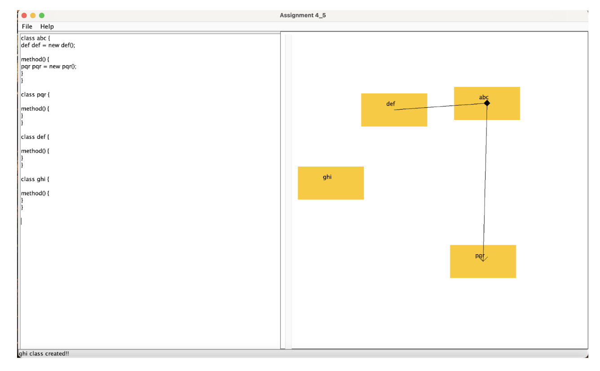

UML Generator GUI based app with the three primary class relationships implemented:
Inheritance, Aggregation, Association

Text Pane shows template generated based on selected relationships between classes.

